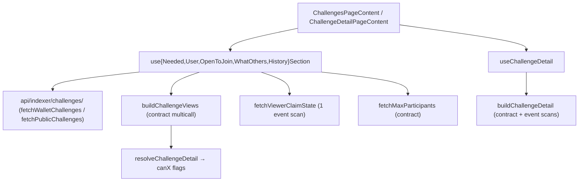

# B3TR Challenges (Quests)

Peer-to-peer or sponsored competitions where users complete X2Earn app actions to win B3TR prizes. Branded as "Quests" in the UI (route `/b3mo-quests`), referred to as "challenges" in code.

## Contract & Config

- **Contract name**: `B3TRChallenges` ([packages/contracts/contracts/B3TRChallenges.sol](packages/contracts/contracts/B3TRChallenges.sol))
- **Interface**: [packages/contracts/contracts/interfaces/IChallenges.sol](packages/contracts/contracts/interfaces/IChallenges.sol)
- **Types lib**: [packages/contracts/contracts/challenges/libraries/ChallengeTypes.sol](packages/contracts/contracts/challenges/libraries/ChallengeTypes.sol)
- **Config address**: `getConfig().challengesContractAddress`
- **Frontend ABI import**: `B3TRChallenges__factory` from `@vechain/vebetterdao-contracts/typechain-types`

## Enums (see [types.ts](apps/frontend/src/api/challenges/types.ts))

| Enum | Values |
|------|--------|
| `ChallengeKind` | `Stake` (0), `Sponsored` (1) |
| `ChallengeVisibility` | `Public` (0), `Private` (1) |
| `ChallengeType` | `MaxActions` (0), `SplitWin` (1) |
| `ChallengeStatus` | `Pending` (0), `Active` (1), `Completed` (2), `Cancelled` (3), `Invalid` (4) |
| `SettlementMode` | `None`, `TopWinners`, `CreatorRefund`, `SplitWinCompleted` |
| `ParticipantStatus` | `None`, `Invited`, `Declined`, `Joined` |

`MaxActions`: capped participant pool, top scorer wins pool. `SplitWin`: uncapped, sponsored-only, first-to-reach-threshold wins a slot.

## Events (lifecycle)

Indexed topics in parens. All lifecycle events have `challengeId` as first indexed topic.

| Event | Indexed user topic | Purpose |
|-------|-------------------|---------|
| `ChallengeCreated` | `creator`, `endRound` | New challenge + all metadata |
| `SplitWinConfigured` | — | Fired right after `ChallengeCreated` for Split Win only |
| `ChallengeInviteAdded` | `invitee` | Invitation to a private challenge |
| `ChallengeJoined` | `participant` | User joined |
| `ChallengeLeft` | `participant` | User left before start (Pending only) |
| `ChallengeDeclined` | `participant` | Invitee declined |
| `ChallengeCancelled` | — | Creator cancelled (Pending) |
| `ChallengeActivated` | — | Pending → Active (sync) |
| `ChallengeInvalidated` | — | Pending → Invalid (sync) |
| `ChallengeCompleted` | — | Active → Completed, carries `settlementMode`, `bestScore`, `bestCount` |
| `ChallengePayoutClaimed` | `account` | MaxActions winner claimed |
| `ChallengeRefundClaimed` | `account` | Cancelled/Invalid refund claimed |
| `SplitWinPrizeClaimed` | `winner` | SplitWin slot claimed (`prize`, `actions`, `winnersClaimed`) |
| `SplitWinCreatorRefunded` | `creator` | Creator reclaimed unclaimed slots after `endRound` |

## Key View Functions

- `getChallenge(id)` → `ChallengeView` struct (all scalar fields + counts)
- `getChallengeStatus(id)` → **computed** status (preferred over the struct's stored `status` — reflects time-based transitions without needing `syncChallenge` first)
- `getChallengeParticipants(id)` / `getChallengeInvited(id)` / `getChallengeDeclined(id)` / `getChallengeWinners(id)` / `getChallengeSelectedApps(id)` → `address[]` / `bytes32[]`
- `getParticipantStatus(id, account)` → `ParticipantStatus`. **After `ChallengeLeft`, returns `None`** (not a stored "Left" state) — datasource must consult the `ChallengeLeft` event to detect left users.
- `isInvitationEligible(id, account)` → can join/re-accept (even after decline)
- `isSplitWinWinner(id, account)` → in winners list
- `getParticipantActions(id, participant)` → live action count
- `maxParticipants()` → default max for MaxActions
- `minBetAmount()` → minimum stake (wei)

## Frontend Architecture

**Lists (sections + history) use the indexer. Detail is still event-based.** Split:

- **Transport** ([api/indexer/challenges/](apps/frontend/src/api/indexer/challenges/)): thin HTTP fetchers for `GET /api/v1/b3tr/challenges` (public, status-filtered) and `GET /api/v1/b3tr/users/{wallet}/challenges?filter=...` (wallet-scoped). 5 `ChallengeFilter` values map 1:1 to the 5 UI sections.
- **Orchestration** ([api/challenges/](apps/frontend/src/api/challenges/)): each section hook composes the indexer fetcher + `buildChallengeViews` (contract multicall) inline — the indexer gives IDs + createdAt, the multicall enriches with per-viewer `canX` flags.

Pagination: `CHALLENGES_PAGE_SIZE = 12`. Indexer `data[].challengeId` drives the multicall; `pagination.hasNext` drives `useInfiniteQuery.getNextPageParam`.

### Event scans still live

- `fetchChallengeEvents` caches per-event+filter via `queryClient.fetchQuery` (30s stale)
- `fetchViewerClaimState` scans 4 viewer-scoped claim events → sets of ids where the viewer already claimed. **Still used** because `ChallengeSummaryResponse` doesn't expose per-viewer claim flags yet (tracked in `B3trUserChallenge.hasClaimedPrize/Refund` server-side; follow-up: expose on the wire).
- `fetchChallengeClaimedBy` scans per-challenge claim events for the detail view's `claimedBy` / `refundedBy` / `creatorRefunded` arrays

### Build helpers (contract multicall)

- [`buildChallengeView.ts`](apps/frontend/src/api/challenges/buildChallengeView.ts): multicall `getChallenge + getChallengeStatus + getParticipantStatus + isInvitationEligible + isSplitWinWinner + getParticipantActions` per id, then `resolveChallengeDetail` → `ChallengeView`
- [`buildChallengeDetail.ts`](apps/frontend/src/api/challenges/buildChallengeDetail.ts): same + `getChallengeParticipants/Invited/Declined/SelectedApps/Winners` + `fetchChallengeClaimedBy` + `ChallengeCreated` event lookup for `createdAt`

### Wei/Ether boundary

**Critical**: raw contract values (`stakeAmount`, `totalPrize`, `prizePerWinner`) are `uint256` wei. UI expects ether strings. `buildChallengeView` and `buildChallengeDetail` convert with `formatEther()`. `threshold` and `bestScore` are action counts, not B3TR — **never** format with `formatEther`. The indexer already returns wei-stripped ether strings for these fields but we discard them (multicall values win to keep freshness after a tx).

## Section Definitions

Each section hook picks a fetcher + filter. The indexer's `ChallengeFilter` (see `packages/common/src/main/kotlin/org/vechain/indexer/b3tr/challenges/ChallengeFilter.kt` in the indexer repo) encodes the same predicates we previously applied client-side, so no post-fetch `.filter()` is needed.

| Section | Viewer present → fetcher | Guest fallback |
|---------|--------------------------|----------------|
| Action needed | `fetchWalletChallenges(viewer, "NeededAction")` | — (viewer-only) |
| Your Challenges | `fetchWalletChallenges(viewer, "MyChallenges")` | — (viewer-only) |
| Open to Join | `fetchWalletChallenges(viewer, "OpenToJoin")` | `fetchPublicChallenges("Pending")` |
| What Others Are Doing | `fetchWalletChallenges(viewer, "OthersActive")` | `fetchPublicChallenges("Active")` |
| History | `fetchWalletChallenges(viewer, "History")` | — (viewer-only) |

`NeededAction` bucket on the server already covers outstanding invites + claimable + finalizable + reclaimable. `History` covers two cases the user perceives as "no longer current": (1) terminal-state (Completed/Cancelled/Invalid) challenges the wallet was involved in, plus (2) still-live (Pending/Active) challenges the wallet has actively bowed out of — declined invitations and joined-then-left participants (detected as non-creator records with `participantStatus ∈ {None, Declined}`). Re-accept / re-join works straight from the History card via the existing `canAccept` / `canJoin` flags. The UI `CurrentTab` still dedupes across sections in render order; History is its own tab so a left-Pending-Public challenge can appear in both History and OpenToJoin.

## resolveChallengeDetail flags ([resolveChallengeDetail.ts](apps/frontend/src/api/challenges/resolveChallengeDetail.ts))

Pure function from raw state → per-viewer `canX` booleans. Key rules:

- `canJoin`: `Pending && Public && !joined && !creator && !atParticipantLimit`
- `canAccept`: `Pending && (invited \|\| eligibleInvitee) && !atLimit` (also true for declined-but-eligible)
- `canComplete`: MaxActions + `Active` + `endRound < currentRound` + (isCreator \|\| isJoined)
- `canClaim`: MaxActions + `Completed` + joined + `participantActions === bestScore` (or isCreator for `CreatorRefund` settlement)
- `canClaimSplitWin`: SplitWin + `Active` + joined + inWindow + `participantActions >= threshold` + slots left
- `canClaimCreatorSplitWinRefund`: SplitWin + creator + `currentRound > endRound` + slots left + `!creatorRefunded`
- `canRefund`: `Cancelled\|Invalid` + (Stake ? joined : creator) + not already refunded
- `isActionable`: any `canX` OR pending invite acceptable
- `isHistorical`: `(declined && canAccept)` OR `(terminal && (creator \|\| joined) && !needsPastAction)`
- `isParticipating`: `(Pending\|Active)` + not awaiting completion + (creator \|\| joined)
- `wasInvited`: equals `isInvitationEligible` — true iff the viewer was ever in the invited pool (flag never gets cleared on-chain). Used by the leave action to decide whether to chain a decline clause.

## UI Structure

[ChallengesPageContent](apps/frontend/src/app/b3mo-quests/components/ChallengesPageContent.tsx) is a 2-tab shell:

- **Current** ([CurrentTab.tsx](apps/frontend/src/app/b3mo-quests/components/CurrentTab.tsx)): 4 `SectionCarousel`s (Action needed, Your Challenges, Open to Join, What Others Are Doing). **Cross-section dedup at the UI layer**: items are assigned to the first matching section in render order; later sections drop duplicates via `SectionCarousel`'s `items` override prop. Empty sections auto-hide (`hideWhenEmpty`).
- **History** ([HistoryTab.tsx](apps/frontend/src/app/b3mo-quests/components/HistoryTab.tsx)): `ChallengesGrid` infinite scroll, items deduped by `challengeId`. **No filters** (sections already segment meaningfully; filters added noise).

`SectionCarousel` uses Swiper with `onReachEnd` → auto `fetchNextPage`, skeleton slides while `isFetchingNextPage`. `ChallengesGrid` uses an IntersectionObserver sentinel + skeleton grid cards.

`ChallengeCard` action buttons come from `canX` flags; detail page uses the same flags (`ChallengeActionsRow`, modals under [`[challengeId]/components/`](apps/frontend/src/app/b3mo-quests/[challengeId]/components/)).

## Section Hooks ([useChallengeSections.ts](apps/frontend/src/api/challenges/useChallengeSections.ts))

One `useInfiniteQuery` per section with stable query keys under `["challenges", "section", sectionId, viewer]`. Each hook's `queryFn` = indexer fetch → `buildSectionPage` (claim-state + maxParticipants + `buildChallengeViews`). Detail via [`useChallengeDetail`](apps/frontend/src/api/challenges/useChallengeDetail.ts) with key `["challenges", "detail", id, viewer]` — calls `buildChallengeDetail` directly (no datasource indirection).

## Write path ([useChallengeActions.ts](apps/frontend/src/api/challenges/useChallengeActions.ts))

Builds multi-clause txs (approve+action for stake joins, leave+decline for invited users). After success:

1. Invalidates `["challenges"]` + claim-event keys broadly
2. Actively refetches `["challenges", "section"]` + `["challenges", "detail"]`
3. Schedules follow-up refetches at 1.5s / 4s / 8s to catch the tx being indexed in new events

**Leave + decline chaining**: `leaveChallenge(challenge)` takes a `ChallengeView`; if `challenge.wasInvited` is true it appends a `declineChallenge` clause to the same tx. Without this the contract re-adds the user to the invited pool on leave (because `invitationEligible` is never cleared), so they'd land back as "invited" instead of fully opting out. The decline clause is omitted when the user was never invited — `declineChallenge` would revert with `NotInvited`.

**Query-key prefix convention**: every challenges-related cache key starts with `["challenges", ...]` so the broad invalidation always hits.

## Key Files Reference

Frontend:
- Transport (indexer): [api/indexer/challenges/](apps/frontend/src/api/indexer/challenges/) — `fetchWalletChallenges`, `fetchPublicChallenges`, hand-typed response types (swap for schema-derived once `yarn generate:schema` picks up the new endpoints)
- Orchestration + domain: [api/challenges/](apps/frontend/src/api/challenges/) — `useChallengeSections.ts`, `useChallengeDetail.ts`, `useChallengeActions.ts`, `resolveChallengeDetail.ts`, `types.ts`, `buildChallengeView.ts`, `buildChallengeDetail.ts`, `claimState.ts`, `fetchChallengeEvents.ts`, `fetchMaxParticipants.ts`
- Hub UI: [app/b3mo-quests/components/](apps/frontend/src/app/b3mo-quests/components/) (ChallengesPageContent, CurrentTab, HistoryTab, SectionCarousel, ChallengeCard, ChallengesGrid, ChallengeFilters, ChallengeStepsCard, CreateChallengeModal/, CompactSkeleton)
- Detail UI: [app/b3mo-quests/[challengeId]/components/](apps/frontend/src/app/b3mo-quests/[challengeId]/components/)
- Shared UI: [app/b3mo-quests/shared/](apps/frontend/src/app/b3mo-quests/shared/)
- Hooks: [hooks/useChallengesDeployBlock.ts](apps/frontend/src/hooks/useChallengesDeployBlock.ts) (returns `0`)

Contracts:
- [B3TRChallenges.sol](packages/contracts/contracts/B3TRChallenges.sol)
- [interfaces/IChallenges.sol](packages/contracts/contracts/interfaces/IChallenges.sol)
- [challenges/libraries/](packages/contracts/contracts/challenges/libraries/)

## Indexer integration status

- **Lists**: live on indexer (`/b3tr/challenges` + `/b3tr/users/{wallet}/challenges?filter=...`).
- **Detail**: still event-based — `/b3tr/challenges/{id}` endpoint exists but freshness right after a tx isn't guaranteed. Migrate later if desired.
- **Follow-up**: ask the indexer team to expose `hasClaimedPrize` / `hasClaimedRefund` (ideally also `participantStatus`, `bestScore`, `maxParticipants`) on `ChallengeSummaryResponse` so we can drop the last `fetchViewerClaimState` event scan.
- **Schema**: hand-typed in `api/indexer/challenges/types.ts`; swap for `paths`-derived types after `yarn generate:schema` picks up the new endpoints on an updated indexer.

## Conventions

- Translation keys for user-facing text; add via the `translate` skill across all 17 languages
- Status labels: `challengeStatusLabel(status)` in types.ts; don't format manually
- `humanNumber()` / `getCompactFormatter()` from `@repo/utils/FormattingUtils` for B3TR displays (ether strings in, formatted string out)
- i18n label "Quests" replaces "Challenges" in all user-facing copy; code still uses "challenge"; route is `/b3mo-quests`
