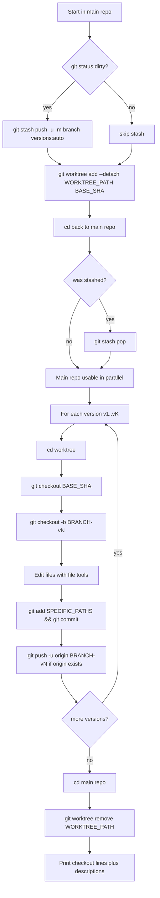

# Branch Versions (single worktree)

Create `K` alternative implementations as separate branches (`<current-branch>-vN`), each pushed to `origin` when possible. The **main repo checkout stays on the user's branch** with their working tree restored right after setup, so they can keep working while the agent finishes variants in one isolated worktree.

## Why this flow

- **Stash + worktree + pop:** frees the main working copy immediately after `stash pop`; variants are built only inside the worktree.
- **One worktree:** fewer Cursor Source Control roots than spawning one worktree per version; remove it when done so nothing lingers under `~/worktrees/`.
- **Push:** remote branches make handoff and CI easy; if `origin` is missing or push fails, branches still exist locally after the worktree is removed.

## Convention

- **Version branches:** `<current-branch>-v<N>` (slashes preserved, e.g. `feat/foo-v1`).
- **Worktree path (reused for all variants):** `~/worktrees/<repo-name>/<branch-flat>-versions/` where `branch-flat` = current branch with `/` replaced by `-`. If the path exists, try `-versions-2`, `-versions-3`, … until `git worktree add` succeeds.
- **Fork point:** `BASE_SHA = git rev-parse HEAD` captured **before** stash (same commit the user was on; stashing does not move HEAD).

## Workflow

When the user asks for `K` versions (or infer `K`):



### 1. Gather context (main repo)

```bash
REPO_ROOT=$(git rev-parse --show-toplevel)
REPO_NAME=$(basename "$REPO_ROOT")
CURRENT_BRANCH=$(git rev-parse --abbrev-ref HEAD)
BRANCH_FLAT=${CURRENT_BRANCH//\//-}
BASE_SHA=$(git rev-parse HEAD)
```

If `CURRENT_BRANCH` is `HEAD` (detached) or `main`/`master`, warn and ask whether to proceed.

Read root `package.json` (and relevant workspace `package.json` in monorepos) for a real dev/test command to mention optionally in the report (never invent script names).

### 2. Dirty tree → stash (main repo)

```bash
git status --porcelain
```

If non-empty:

```bash
git stash push -u -m "branch-versions: auto for ${CURRENT_BRANCH}"
```

Remember `did_stash=true`.

### 3. Add one detached worktree (from main repo)

```bash
mkdir -p ~/worktrees/"$REPO_NAME"
WT=~/worktrees/"$REPO_NAME"/"${BRANCH_FLAT}-versions"
# If WT exists, bump suffix: ...-versions-2, -versions-3, ...
git worktree add --detach "$WT" "$BASE_SHA"
```

### 4. Return to main repo and restore stash

From `REPO_ROOT`:

```bash
cd "$REPO_ROOT"
```

If `did_stash`: `git stash pop`. If conflicts: **stop**, tell the user to resolve; do not continue into the worktree until main is clean or user confirms.

From here the **main repo is usable** in parallel; all variant work happens under `$WT`.

### 5. Next free `vN` (run from main repo)

```bash
git branch --list "${CURRENT_BRANCH}-v*"
```

Parse `-vN` suffixes: `next = max(N) + 1` (or `1` if none).

### 6. Build each version (only inside `$WT`)

For `i = 0 .. K-1`, `N = next + i`, `VERSION_BRANCH="${CURRENT_BRANCH}-v${N}"`:

```bash
cd "$WT"
git checkout "$BASE_SHA"
git checkout -b "$VERSION_BRANCH"
```

Make edits using file tools with paths under `$WT/...`.

```bash
git add <explicit paths only>
```

Never `git add -A` or `git add .` (avoids unrelated untracked files).

```bash
git commit -m "<descriptive variant message>"
```

Push (if `origin` exists):

```bash
git remote get-url origin >/dev/null 2>&1 && git push -u origin "$VERSION_BRANCH"
```

If `checkout -b` fails (branch exists), bump `N` and retry. If push fails, warn in the final report; branch remains local.

**Hooks in worktree:** if `husky` / `lint-staged` fails because `node_modules` or `.husky/_` is missing in the worktree, symlink `node_modules` from `$REPO_ROOT` into `$WT` and/or copy `$REPO_ROOT/.husky/_` into `$WT/.husky/_`, then retry commit — do not use `--no-verify` unless the user explicitly allows it.

### 7. Tear down (main repo)

```bash
cd "$REPO_ROOT"
git worktree remove "$WT"
```

If remove fails (dirty worktree), surface `git status` from `$WT` and ask the user; `git worktree remove "$WT" --force` only if they confirm.

### 8. Report (terminal)

Compact block: one line per version = `git checkout` + short `#` description.

```
Versions (forked from <CURRENT_BRANCH> @ <BASE_SHA short>):

  git checkout <CURRENT_BRANCH>-v1   # <one-line variant summary>
  git checkout <CURRENT_BRANCH>-v2   # <one-line variant summary>

Back to your branch:
  git checkout <CURRENT_BRANCH>

Worktree removed. Pushed: origin/<CURRENT_BRANCH>-vN (or note if push skipped/failed).
```

Optional second line per version with the detected dev command if useful.

## Edge cases

- **No `origin`:** skip push; say so in report.
- **Push auth / network failure:** warn; branches still exist locally.
- **Worktree path collision:** suffix `-versions-2`, `-versions-3`, …
- **Repo with no commits:** `git worktree add` fails — surface error, stop.
- **Interrupted run:** user from main: `git worktree list`, `git worktree remove <path> --force` if needed, `git worktree prune`, `git stash list` to recover stash.

## Cleanup (branches)

Never `git branch -D` version branches without explicit user confirmation.
