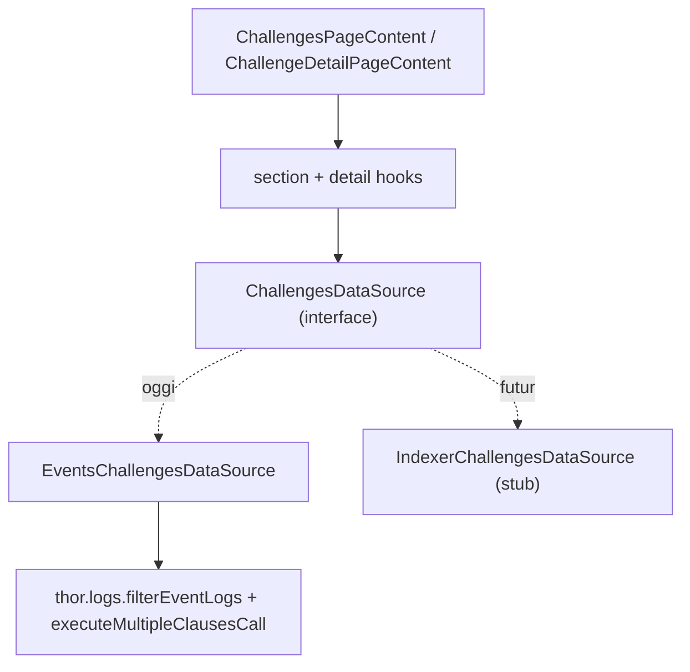

# B3TR Challenges (Quests)

Peer-to-peer or sponsored competitions where users complete X2Earn app actions to win B3TR prizes. Branded as "Quests" in the UI, referred to as "challenges" in code.

## Contract & Config

- **Contract name**: `B3TRChallenges` ([packages/contracts/contracts/B3TRChallenges.sol](packages/contracts/contracts/B3TRChallenges.sol))
- **Interface**: [packages/contracts/contracts/interfaces/IChallenges.sol](packages/contracts/contracts/interfaces/IChallenges.sol)
- **Types lib**: [packages/contracts/contracts/challenges/libraries/ChallengeTypes.sol](packages/contracts/contracts/challenges/libraries/ChallengeTypes.sol)
- **Config address**: `getConfig().challengesContractAddress`
- **Frontend ABI import**: `B3TRChallenges__factory` from `@vechain/vebetterdao-contracts/typechain-types`

## Enums (see [types.ts](apps/frontend/src/api/challenges/types.ts))

| Enum | Values |
|------|--------|
| `ChallengeKind` | `Stake` (0), `Sponsored` (1) |
| `ChallengeVisibility` | `Public` (0), `Private` (1) |
| `ChallengeType` | `MaxActions` (0), `SplitWin` (1) |
| `ChallengeStatus` | `Pending` (0), `Active` (1), `Completed` (2), `Cancelled` (3), `Invalid` (4) |
| `SettlementMode` | `None`, `TopWinners`, `CreatorRefund`, `SplitWinCompleted` |
| `ParticipantStatus` | `None`, `Invited`, `Declined`, `Joined` |

`MaxActions`: capped participant pool, top scorer wins pool. `SplitWin`: uncapped, sponsored-only, first-to-reach-threshold wins a slot.

## Events (lifecycle)

Indexed topics in parens. All lifecycle events have `challengeId` as first indexed topic.

| Event | Indexed user topic | Purpose |
|-------|-------------------|---------|
| `ChallengeCreated` | `creator`, `endRound` | New challenge + all metadata |
| `SplitWinConfigured` | — | Fired right after `ChallengeCreated` for Split Win only |
| `ChallengeInviteAdded` | `invitee` | Invitation to a private challenge |
| `ChallengeJoined` | `participant` | User joined |
| `ChallengeLeft` | `participant` | User left before start (Pending only) |
| `ChallengeDeclined` | `participant` | Invitee declined |
| `ChallengeCancelled` | — | Creator cancelled (Pending) |
| `ChallengeActivated` | — | Pending → Active (sync) |
| `ChallengeInvalidated` | — | Pending → Invalid (sync) |
| `ChallengeCompleted` | — | Active → Completed, carries `settlementMode`, `bestScore`, `bestCount` |
| `ChallengePayoutClaimed` | `account` | MaxActions winner claimed |
| `ChallengeRefundClaimed` | `account` | Cancelled/Invalid refund claimed |
| `SplitWinPrizeClaimed` | `winner` | SplitWin slot claimed (`prize`, `actions`, `winnersClaimed`) |
| `SplitWinCreatorRefunded` | `creator` | Creator reclaimed unclaimed slots after `endRound` |

## Key View Functions

- `getChallenge(id)` → `ChallengeView` struct (all scalar fields + counts)
- `getChallengeStatus(id)` → **computed** status (preferred over the struct's stored `status` — reflects time-based transitions without needing `syncChallenge` first)
- `getChallengeParticipants(id)` / `getChallengeInvited(id)` / `getChallengeDeclined(id)` / `getChallengeWinners(id)` / `getChallengeSelectedApps(id)` → `address[]` / `bytes32[]`
- `getParticipantStatus(id, account)` → `ParticipantStatus`. **After `ChallengeLeft`, returns `None`** (not a stored "Left" state) — datasource must consult the `ChallengeLeft` event to detect left users.
- `isInvitationEligible(id, account)` → can join/re-accept (even after decline)
- `isSplitWinWinner(id, account)` → in winners list
- `getParticipantActions(id, participant)` → live action count
- `maxParticipants()` → default max for MaxActions
- `minBetAmount()` → minimum stake (wei)

## Frontend Architecture



**Everything is event-based today. No indexer dependency for `/challenges/*` endpoints.** Non-challenge indexer hooks (e.g. `/actions/users/{wallet}` via `useChallengeUserActions`) are kept.

### DataSource ([datasource/ChallengesDataSource.ts](apps/frontend/src/api/challenges/datasource/ChallengesDataSource.ts))

```typescript
interface ChallengesDataSource {
  getNeededActions(viewer, args?: PaginationArgs): Promise<ChallengePage>
  getUserChallenges(viewer, args?: PaginationArgs): Promise<ChallengePage>
  getOpenToJoin(viewer?, args?): Promise<ChallengePage>
  getWhatOthersAreDoing(viewer?, args?): Promise<ChallengePage>
  getHistory(viewer, args?): Promise<ChallengePage>
  getChallengeDetail(id, viewer?): Promise<ChallengeDetail | null>
}
```

- `PaginationArgs`: `{ page?: number, size?: number }` (default size 12 = `CHALLENGES_PAGE_SIZE`)
- `ChallengePage`: `{ data: ChallengeView[], pagination: { hasNext, cursor? } }` — same shape as old indexer response
- Events impl ignores pagination and returns all matching results in one page (`hasNext: false`)
- Indexer impl (stub) will map `page`/`size` to `?page=X&size=Y` query params when endpoints land
- Factory: [`useChallengesDataSource`](apps/frontend/src/api/challenges/datasource/useChallengesDataSource.ts)

### Event scanning ([datasource/events/](apps/frontend/src/api/challenges/datasource/events/))

- `fetchChallengeEvents` caches per-event+filter via `queryClient.fetchQuery` (30s stale)
- `fetchViewerChallengeIds` does **5 parallel scans** for the viewer: created/joined/invited/declined/left — returns sets of ids
- `fetchViewerClaimState` scans 4 claim events filtered by viewer address → sets of ids where user already claimed
- `buildChallengeView`: multicall `getChallenge + getChallengeStatus + getParticipantStatus + isInvitationEligible + isSplitWinWinner + getParticipantActions` per id, then `resolveChallengeDetail` → `ChallengeView`
- `buildChallengeDetail`: same + `getChallengeParticipants/Invited/Declined/SelectedApps/Winners` + `fetchChallengeClaimedBy` (per-challenge claim events) for full arrays

### Wei/Ether boundary

**Critical**: raw contract values (`stakeAmount`, `totalPrize`, `prizePerWinner`) are `uint256` wei. UI expects ether strings. `buildChallengeView` and `buildChallengeDetail` convert with `formatEther()`. `threshold` and `bestScore` are action counts, not B3TR — **never** format with `formatEther`.

## Section Definitions

Each section composes id sets from the 5 viewer scans + filters via `resolveChallengeDetail`-derived flags.

| Section | ID sources | Filter |
|---------|------------|--------|
| Needed Action | created ∪ joined ∪ invited ∪ declined | `v.isActionable` |
| Your Challenges | created ∪ joined | `Pending\|Active && (isCreator \|\| isJoined)` — filter naturally excludes left-and-not-re-joined (status=None) |
| Open to Join | all `ChallengeCreated` | `Pending && Public && canJoin` |
| What Others Are Doing | all `ChallengeCreated` | `Active && Public && !isCreator && !isJoined` |
| History | created ∪ joined ∪ invited ∪ declined ∪ left | `v.isHistorical \|\| (leftIds.has(id) && !v.isJoined)` |

History relies on two things:
1. **Leave + decline chaining in `useChallengeActions`** puts invited leavers into Declined on-chain, which `isHistorical` picks up via its `(declined && canAccept)` branch (Pending challenges) — so invited leavers land in the existing Declined / "Changed your mind? Accept" flow for free.
2. **`leftIds` Set fallback** catches terminal cases (Active/Completed/Cancelled/Invalid) where `canAccept` is false and `isHistorical` alone would miss the challenge.

## resolveChallengeDetail flags ([resolveChallengeDetail.ts](apps/frontend/src/api/challenges/resolveChallengeDetail.ts))

Pure function from raw state → per-viewer `canX` booleans. Key rules:

- `canJoin`: `Pending && Public && !joined && !creator && !atParticipantLimit`
- `canAccept`: `Pending && (invited \|\| eligibleInvitee) && !atLimit` (also true for declined-but-eligible)
- `canComplete`: MaxActions + `Active` + `endRound < currentRound` + (isCreator \|\| isJoined)
- `canClaim`: MaxActions + `Completed` + joined + `participantActions === bestScore` (or isCreator for `CreatorRefund` settlement)
- `canClaimSplitWin`: SplitWin + `Active` + joined + inWindow + `participantActions >= threshold` + slots left
- `canClaimCreatorSplitWinRefund`: SplitWin + creator + `currentRound > endRound` + slots left + `!creatorRefunded`
- `canRefund`: `Cancelled\|Invalid` + (Stake ? joined : creator) + not already refunded
- `isActionable`: any `canX` OR pending invite acceptable
- `isHistorical`: `(declined && canAccept)` OR `(terminal && (creator \|\| joined) && !needsPastAction)`
- `isParticipating`: `(Pending\|Active)` + not awaiting completion + (creator \|\| joined)
- `wasInvited`: equals `isInvitationEligible` — true iff the viewer was ever in the invited pool (flag never gets cleared on-chain). Used by the leave action to decide whether to chain a decline clause.

## UI Structure

[ChallengesPageContent](apps/frontend/src/app/challenges/components/ChallengesPageContent.tsx) is a 2-tab shell:

- **Current** ([CurrentTab.tsx](apps/frontend/src/app/challenges/components/CurrentTab.tsx)): 4 `SectionCarousel`s (Needed Action, Your Challenges, Open to Join, What Others Are Doing). **Cross-section dedup at the UI layer**: items are assigned to the first matching section in render order; later sections drop duplicates via `SectionCarousel`'s `items` override prop. Empty sections auto-hide (`hideWhenEmpty`).
- **History** ([HistoryTab.tsx](apps/frontend/src/app/challenges/components/HistoryTab.tsx)): `ChallengesGrid` infinite scroll, items deduped by `challengeId`. **No filters** (sections already segment meaningfully; filters added noise).

`SectionCarousel` uses Swiper with `onReachEnd` → auto `fetchNextPage`, skeleton slides while `isFetchingNextPage`. `ChallengesGrid` uses an IntersectionObserver sentinel + skeleton grid cards.

`ChallengeCard` action buttons come from `canX` flags; detail page uses the same flags (`ChallengeActionsRow`, modals under [`[challengeId]/components/`](apps/frontend/src/app/challenges/[challengeId]/components/)).

## Section Hooks ([useChallengeSections.ts](apps/frontend/src/api/challenges/useChallengeSections.ts))

One `useInfiniteQuery` per section with stable query keys under `["challenges", "section", sectionId, viewer]`. Detail via [`useChallengeDetail`](apps/frontend/src/api/challenges/useChallengeDetail.ts) with key `["challenges", "detail", id, viewer]`.

## Write path ([useChallengeActions.ts](apps/frontend/src/api/challenges/useChallengeActions.ts))

Builds multi-clause txs (approve+action for stake joins, leave+decline for invited users). After success:

1. Invalidates `["challenges"]` + claim-event keys broadly
2. Actively refetches `["challenges", "section"]` + `["challenges", "detail"]`
3. Schedules follow-up refetches at 1.5s / 4s / 8s to catch the tx being indexed in new events

**Leave + decline chaining**: `leaveChallenge(challenge)` takes a `ChallengeView`; if `challenge.wasInvited` is true it appends a `declineChallenge` clause to the same tx. Without this the contract re-adds the user to the invited pool on leave (because `invitationEligible` is never cleared), so they'd land back as "invited" instead of fully opting out. The decline clause is omitted when the user was never invited — `declineChallenge` would revert with `NotInvited`.

**Query-key prefix convention**: every challenges-related cache key starts with `["challenges", ...]` so the broad invalidation always hits.

## Key Files Reference

Frontend:
- Data: [datasource/](apps/frontend/src/api/challenges/datasource/), [useChallengeSections.ts](apps/frontend/src/api/challenges/useChallengeSections.ts), [useChallengeDetail.ts](apps/frontend/src/api/challenges/useChallengeDetail.ts), [useChallengeActions.ts](apps/frontend/src/api/challenges/useChallengeActions.ts), [resolveChallengeDetail.ts](apps/frontend/src/api/challenges/resolveChallengeDetail.ts), [types.ts](apps/frontend/src/api/challenges/types.ts)
- Hub UI: [app/challenges/components/](apps/frontend/src/app/challenges/components/) (ChallengesPageContent, CurrentTab, HistoryTab, SectionCarousel, ChallengeCard, ChallengesGrid, ChallengeFilters, ChallengeStepsCard, CreateChallengeModal/, CompactSkeleton)
- Detail UI: [app/challenges/[challengeId]/components/](apps/frontend/src/app/challenges/[challengeId]/components/)
- Shared UI: [app/challenges/shared/](apps/frontend/src/app/challenges/shared/)
- Hooks: [hooks/useChallengesDeployBlock.ts](apps/frontend/src/hooks/useChallengesDeployBlock.ts) (returns `0`)

Contracts:
- [B3TRChallenges.sol](packages/contracts/contracts/B3TRChallenges.sol)
- [interfaces/IChallenges.sol](packages/contracts/contracts/interfaces/IChallenges.sol)
- [challenges/libraries/](packages/contracts/contracts/challenges/libraries/)

## Extending to Indexer

When `/api/v1/b3tr/challenges/*` endpoints ship:

1. Implement `createIndexerChallengesDataSource()` in [datasource/indexer/indexerDataSource.ts](apps/frontend/src/api/challenges/datasource/indexer/indexerDataSource.ts) — map each method to the corresponding endpoint with `page`/`size` passthrough.
2. Switch the factory in [useChallengesDataSource.ts](apps/frontend/src/api/challenges/datasource/useChallengesDataSource.ts) to return the indexer impl (optionally behind an env flag).
3. UI, hooks, query keys stay unchanged.

## Conventions

- Translation keys for user-facing text; add via the `translate` skill across all 17 languages
- Status labels: `challengeStatusLabel(status)` in types.ts; don't format manually
- `humanNumber()` / `getCompactFormatter()` from `@repo/utils/FormattingUtils` for B3TR displays (ether strings in, formatted string out)
- i18n label "Quests" replaces "Challenges" in all user-facing copy; code still uses "challenge"
